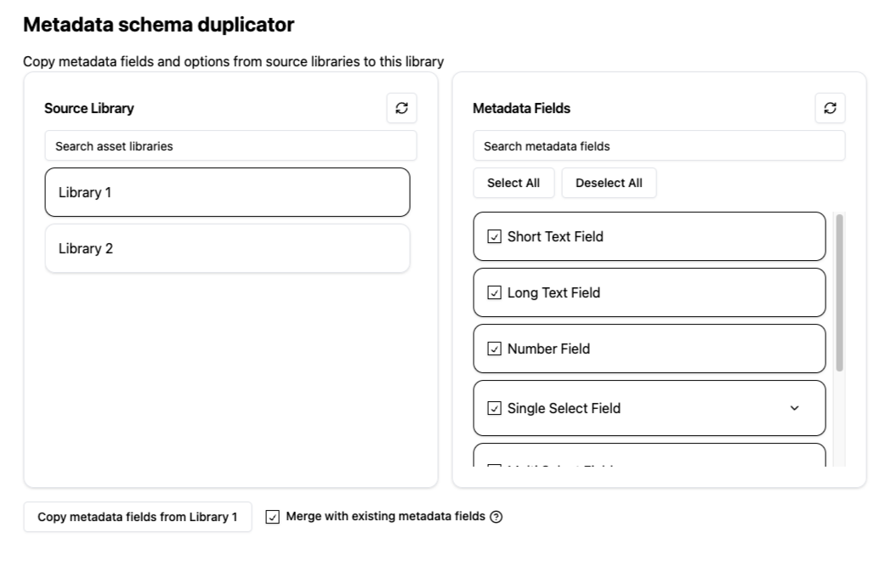

# Frontify Metadata Schema Copy App
An example Frontify SDK app that can be used to copy metadata fields and options from a source library to the current library

This App was made in a weekend, scaffolded using v0.dev and ShadCN components. There are many ways that this could be optimised and is honestly a messy codebase, and is to be considered a proof of concept only.

### Disclaimer:
- This project is not an official Frontify product and is not affiliated with Frontify in any way

- This project includes zero test coverage

- The code in this repository is provided "as is", with all faults. There are no warranties or gaurantees, expressed or implied. 

- The quality and maintenance of this repository is not guaranteed and should be used for inspiration only

### Installation:
Replace the App ID in the manifest.json file with your own and follow the steps to deploy privately in the [Frontify API Documentation](https://developer.frontify.com/document/2580#/getting-started/marketplace) using the ```npx @frontify/frontify-cli@latest deploy --noVerify``` command to skip linting.


### Screenshots:


